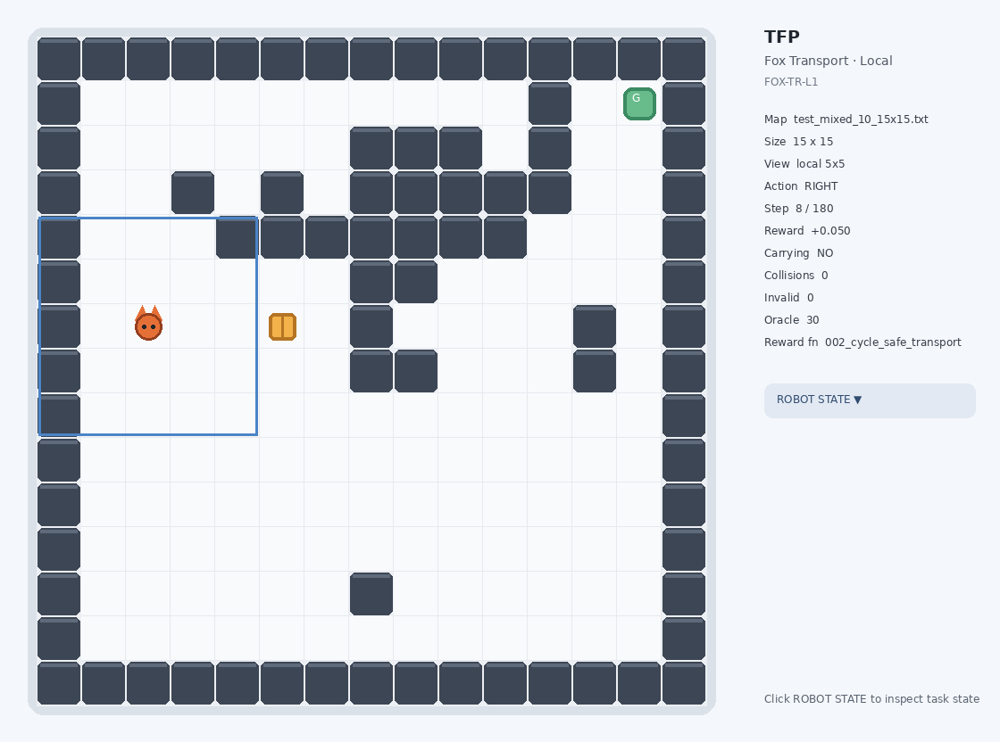
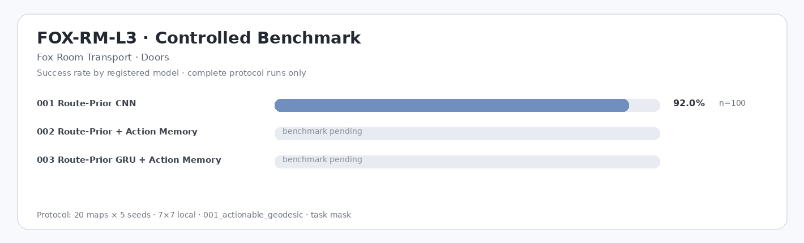

# TFP — Traveling Fox Problems

**A lightweight PyTorch POMDP benchmark for controlled reinforcement-learning studies on local perception, memory, exploration, interaction timing, and deadlock behavior.**



TFP is organized as a multi-task research framework rather than a single environment. Each task owns its maps, models, rewards, experiment presets, checkpoints, and result namespace, while PPO training, evaluation, diagnostics, and visualization remain shared. The repository is designed for compact ablation studies on resource-constrained agents using reproducible **map × seed** evaluation.

## Tasks

| Code | Task | Train / test maps | Local view | Objective |
|---|---|---:|---|---|
| `FOX-TR-L1` | **Fox Transport · Local** | 54 / 18 | 5×5, 7×7 | find one cargo item and deliver it to the destination |
| `FOX-CS-L2` | **Fox Color Sort · Local** | 45 / 15 | 5×5, 7×7 | collect 2–5 colored objects and deliver each to the matching colored destination |
| `FOX-RM-L3` | **Fox Room Transport · Doors** | 50 / 20 | 5×5, 7×7 | find seeded cargo across variable multi-room layouts, operate doors, and deliver it across rooms |

### FOX-TR-L1 — local transport

A partially observable navigation-and-interaction task intended to expose short behavior cycles, perceptual aliasing, delayed pickup/delivery decisions, and exploration failures. Maps span 10×10, 15×15, and 20×20 layouts with multiple structural families. It is the primary task for studying **action memory, recurrent policies, Tabu/TabuX, intrinsic exploration, bootstrap training, and reward-shaping ablations**.

### FOX-CS-L2 — color-conditioned sorting

A lower-topological-complexity but higher task-state-complexity problem. Each episode contains 2–5 colored objects and matching destinations; the fox carries one item at a time and must infer which interaction and target are currently relevant from a local observation. Maps span 8×8, 10×10, and 12×12 layouts. The task is intended for **goal conditioning, multi-stage completion, interaction learning, and recurrent memory under color-specific objectives**.

### FOX-RM-L3 — multi-room transport with doors

A longer-horizon transport task over variable multi-room layouts. Five packaged scale tiers cover **15×15 / 19×19 / 23×23 / 27×27 / 31×31** maps, from 2×2 to 4×4 room lattices. V5 replaces the unsuccessful V4 room baselines with a **Residual Route-Prior PPO** formulation: the policy still sees only a local 5×5/7×7 crop, but receives a two-value shortest-route doorway waypoint cue instead of a misleading straight-line target vector. Closed doors contribute an explicit `TOGGLE + MOVE` cost to the learning distance, preventing door-toggle reward farming. The three V5 models isolate structured route fusion, compact action memory, and recurrent room memory under one common reward.

`FOX-TR-L1` and `FOX-CS-L2` use six actions: four-neighbor motion, `PICKUP`, and `DROP`. `FOX-RM-L3` adds a seventh `TOGGLE_DOOR` action. `task` masking forces pickup/delivery when required but leaves door operation as a learned decision; `valid` masking leaves all valid interactions to the policy.

## Controlled benchmark results

README benchmark tables are **not last-run snapshots**. A result enters these tables only when it completes the task's full packaged test-map × default-seed matrix under the controlled protocol: default local view, default reward, `task` mask, and `001_ppo_categorical`. Repeated qualifying runs for the same model are averaged. Smoke tests, partial evaluations, custom rewards, and other ablations remain available in **TFP Studio → Compare** but cannot silently overwrite the benchmark.

### FOX-TR-L1

<!-- TFP-BENCHMARK:FOX-TR-L1:START -->
| Model | Params | Runs | N | Success ↑ | Completion ↑ | Pickup ↑ | Steps ↓ | Return ↑ | Path Eff. ↑ | Collision ↓ | Invalid ↓ | Cycles ↓ | Interact cycles ↓ | Revisit ↓ | Infer ms ↓ |
|---|---:|---:|---:|---:|---:|---:|---:|---:|---:|---:|---:|---:|---:|---:|---:|
| `001_simple_cnn` | 121.8k | 1 | 180 | 37.8% | 37.8% | 73.9% | 125.3 | 5.42 | 0.996 | 0.00 | 0.00 | 107.61 | 0.00 | 57.1% | 0.277 |
| `002_simple_cnn_tabu` | 121.8k | 1 | 180 | 55.6% | 55.6% | 73.9% | 102.0 | 6.74 | 0.835 | 0.00 | 0.00 | 16.19 | 0.00 | 47.2% | 0.328 |
| `003_action_memory_cnn` | 132.4k | 1 | 180 | 57.8% | 57.8% | 75.6% | 93.3 | 6.94 | 0.988 | 0.00 | 0.00 | 73.88 | 0.00 | 39.6% | 0.731 |
| `004_simple_cnn_tabux` | 121.8k | 1 | 180 | 87.8% | 87.8% | 93.3% | 58.1 | 9.66 | 0.828 | 0.00 | 0.00 | 7.09 | 0.00 | 20.0% | 0.458 |
| `005_action_memory_tabux_cnn` | 132.4k | 1 | 180 | 86.1% | 86.1% | 91.7% | 57.2 | 9.49 | 0.881 | 0.00 | 0.00 | 6.67 | 0.00 | 19.0% | 0.905 |
| `006_ppo_gru_bootstrap` | 167.4k | — | — | — | — | — | — | — | — | — | — | — | — | — | — |
| `007_ppo_gru_action_memory` | 141.5k | — | — | — | — | — | — | — | — | — | — | — | — | — | — |
| `008_ppo_gru_episodic_count` | 133.3k | — | — | — | — | — | — | — | — | — | — | — | — | — | — |
| `009_ppo_gru_action_memory_tabux` | 141.5k | — | — | — | — | — | — | — | — | — | — | — | — | — | — |
| `010_ppo_gru_gobi` | 133.3k | — | — | — | — | — | — | — | — | — | — | — | — | — | — |

*Controlled protocol: 18 test maps × 10 seeds = 180 episodes/run, `local` 5×5, `001_dense_transport`, `task` mask, `001_ppo_categorical`. Only complete protocol-matched runs enter this table; repeated runs are averaged. `—` means no qualifying benchmark yet.*
<!-- TFP-BENCHMARK:FOX-TR-L1:END -->


### FOX-CS-L2

<!-- TFP-BENCHMARK:FOX-CS-L2:START -->
| Model | Params | Runs | N | Success ↑ | Completion ↑ | Pickup ↑ | Steps ↓ | Return ↑ | Path Eff. ↑ | Collision ↓ | Invalid ↓ | Cycles ↓ | Interact cycles ↓ | Revisit ↓ | Infer ms ↓ |
|---|---:|---:|---:|---:|---:|---:|---:|---:|---:|---:|---:|---:|---:|---:|---:|
| `001_color_cnn` | 125.3k | — | — | — | — | — | — | — | — | — | — | — | — | — | — |
| `002_goal_conditioned_cnn` | 233.8k | — | — | — | — | — | — | — | — | — | — | — | — | — | — |
| `003_goal_gru_action_memory` | 144.9k | — | — | — | — | — | — | — | — | — | — | — | — | — | — |

*Controlled protocol: 15 test maps × 5 seeds = 75 episodes/run, `local` 5×5, `001_dense_color_sort`, `task` mask, `001_ppo_categorical`. Only complete protocol-matched runs enter this table; repeated runs are averaged. `—` means no qualifying benchmark yet.*
<!-- TFP-BENCHMARK:FOX-CS-L2:END -->


### FOX-RM-L3

<!-- TFP-BENCHMARK:FOX-RM-L3:START -->
| Model | Params | Runs | N | Success ↑ | Completion ↑ | Pickup ↑ | Steps ↓ | Return ↑ | Path Eff. ↑ | Collision ↓ | Invalid ↓ | Cycles ↓ | Interact cycles ↓ | Revisit ↓ | Infer ms ↓ |
|---|---:|---:|---:|---:|---:|---:|---:|---:|---:|---:|---:|---:|---:|---:|---:|
| `001_route_prior_cnn` | 393.2k | 1 | 100 | 92.0% | 92.0% | 95.0% | 103.7 | 22.98 | 1.000 | 0.00 | 0.00 | 58.05 | 0.00 | 7.6% | 2.165 |
| `002_route_prior_action_memory` | 422.3k | — | — | — | — | — | — | — | — | — | — | — | — | — | — |
| `003_route_prior_gru_memory` | 520.8k | — | — | — | — | — | — | — | — | — | — | — | — | — | — |

*Controlled protocol: 20 test maps × 5 seeds = 100 episodes/run, `local` 7×7, `001_actionable_geodesic`, `task` mask, `001_ppo_categorical`. Only complete protocol-matched runs enter this table; repeated runs are averaged. `—` means no qualifying benchmark yet.*
<!-- TFP-BENCHMARK:FOX-RM-L3:END -->



## Key research techniques

**Action memory.** TFP can encode a short history of *executed actions* separately from visual features. This is deliberately lower-dimensional than asking a recurrent unit to remember the entire observation stream. In local POMDPs, many failures are defined by action sequence—left/right oscillation, repeated forward/backtracking, or leaving an interaction cell—so recent actions provide a direct cue for loop phase and interaction history. In the packaged Task-1 controlled reference, the Action-Memory CNN improves success over the plain CNN baseline (57.8% vs. 37.8%). Earlier development runs with recurrent visual memory were also less stable, but the GRU rows remain deliberately unreported until they complete the same controlled protocol. We therefore treat action history as a strong compact memory prior rather than claiming that more visual recurrence is universally better.

**Tabu and TabuX.** Tabu controllers operate at inference time and detect short repeated behavior patterns without retraining the neural policy. Basic Tabu suppresses recently repeated action cycles; TabuX extends this idea to local state-action basins so the agent can escape persistent deadlocks while preserving the learned policy elsewhere. This separation is useful experimentally: neural learning quality and deployment-time anti-deadlock control can be measured independently. The controller is intentionally lightweight and can be enabled as an ablation without changing PPO optimization.

**Training strategy.** Training uses compact PPO with task-owned model plugins and deterministic experiment presets. Curriculum settings progressively unlock map-size groups; the five-tier room task therefore advances Small → Medium → Large → Large+ → Large++ rather than exposing all large layouts at once. Evaluation is isolated from training and always uses fixed test maps and seed matrices. Full benchmark runs, smoke integration tests, and custom ablations are explicitly separated in reporting. Recurrent rollouts preserve the exact hidden/action-history context used during data collection so PPO updates do not silently train on a different memory state than the acting policy.

**Reward design.** TFP provides sparse, dense, cycle-safe, and interaction-aware rewards as task-scoped plugins. Dense rewards use geodesic progress to make early learning practical; cycle-safe variants use symmetric progress/regression terms so a two-step oscillation cannot accumulate positive shaping reward. Under `valid` masks, interaction-aware rewards add an opportunity cost when the agent stands on a valid pickup/delivery state but ignores the interaction. `FOX-RM-L3` V5 uses a stricter **actionable geodesic**: a closed-door crossing costs `TOGGLE + MOVE`, so opening a useful door is rewarded only because it decreases executable path cost; opening an irrelevant door has no standalone bonus. This makes reward assumptions explicit and prevents the door open/close loop present in the earlier formulation.

**Residual route prior.** The V5 room models add a fixed action-logit prior computed only from the observable two-value shortest-route doorway waypoint and adjacent-door cue. PPO learns a residual correction on top of that prior. This hybrid inductive bias is intentionally stronger than a generic CNN because the research question is shifted from rediscovering low-level shortest-path geometry to evaluating transport decisions, door interaction, action memory, and recurrent room-state memory. No global map, room graph, full route, or oracle action is passed to the network.

**GoBI-style exploration.** `GoBI Compact` is a resource-aware intrinsic module that combines lifelong count novelty with episodic reachability expansion estimated by a very small latent dynamics model. From the current latent state it imagines a limited set of short action branches, rewarding states that expand the episode's reachable signature set. The imagination budget is intentionally tiny, making the method suitable for testing whether model-based novelty can improve local exploration without turning TFP into a large world-model training project.

**Bootstrap recurrent training.** `PPO-GRU Bootstrap` initializes its visual encoder and actor/value heads from a mature feed-forward CNN checkpoint. The new recurrent residual starts near zero, the transferred visual policy is briefly protected, and memory contribution is smoothly ramped during early fine-tuning. This avoids the destructive transition observed when a random recurrent branch is switched on inside an already learned policy. Bootstrap is therefore treated as a controlled optimization strategy for adding temporal capacity rather than as a separate source of privileged information.

## Task-scoped architecture

```text
tfp/tasks/<task>/
├── maps/train + maps/test
├── models/              # model plugins used only by this task
├── rewards/             # reward plugins used only by this task
└── environment.py       # optional task-owned environment

experiments/<TASK-CODE>/ # reproducible experiment presets
results/<TASK-CODE>/     # evaluation records + controlled benchmark report
checkpoints/<TASK-CODE>/ # local model weights (ignored by Git)
videos/                  # local evaluation videos (ignored by Git)
```

The core trainer and evaluator instantiate environments through the task registry. Adding a new task does not require hard-coding it into PPO.

## TFP Studio

```bash
python tfp_studio.py
```

Select **Task → Model → Reward → 5×5/7×7 view → mask protocol**, then train or evaluate. The **Compare** tab has its own Task selector and can show either all stored records or only controlled benchmark runs, preventing measurements from different tasks from being mixed accidentally.

For reproducible comparisons, vary one intended factor at a time and keep the map × seed matrix, observation size, action mask, reward, policy, and checkpoint role fixed. Inference latency is hardware-dependent and should be interpreted together with the recorded runtime metadata.

## Rebuild reports

Evaluation automatically refreshes the corresponding task report. To regenerate every benchmark table and PNG from stored records:

```bash
python tools/rebuild_reports.py
```

Generated task summaries live at `results/<TASK-CODE>/README.md` and `results/<TASK-CODE>/summary.png`.
