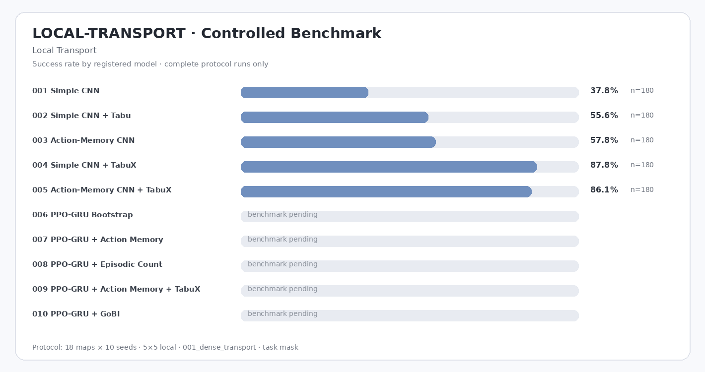
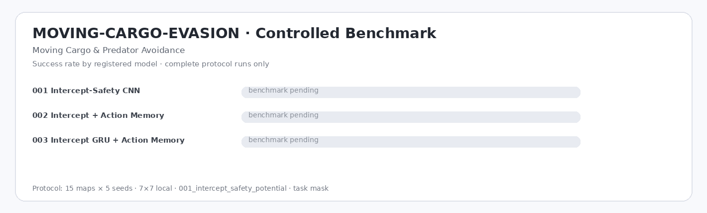

# TFP — Traveling Fox Problems

**A lightweight PyTorch benchmark for reinforcement learning under local perception, memory, interaction, exploration, moving targets, and dynamic hazards.**


TFP is organized as task-scoped research environments sharing one PPO/evaluation stack. Each task owns its maps, models, rewards, experiment presets, checkpoints, and result namespace. Experiments use deterministic map × seed evaluation and support 5×5 / 7×7 local perception.

## Tasks

| Code | Task | Train / test maps | View | Research focus |
|---|---|---:|---|---|
| `LOCAL-TRANSPORT` | **Local Transport** | 54 / 18 | 5×5, 7×7 | exploration, short cycles, pickup/delivery timing, compact memory |
| `COLOR-SORT` | **Color-Matched Sorting** | 45 / 15 | 5×5, 7×7 | multi-object state, goal conditioning, target switching |
| `ROOM-DOOR-TRANSPORT` | **Multi-Room Door Transport** | 50 / 20 | 5×5, 7×7 | long-horizon navigation, room memory, stateful doors |
| `MOVING-CARGO-EVASION` | **Moving Cargo & Predator Avoidance** | 45 / 15 | 5×5, 7×7 | moving-target interception, timing, temporal dynamics, hazard avoidance |

### Local Transport

Single-cargo transport across 10×10, 15×15, and 20×20 layouts. The agent observes only a local crop and must locate cargo, execute `PICKUP`, and deliver it to the destination. The task is intentionally compact enough for controlled ablations while still exposing perceptual aliasing, exploration failure, interaction loops, and deployment-time deadlocks. It is the primary environment for Action Memory, GRU policies, Tabu/TabuX, GoBI-style exploration, bootstrap recurrent training, and reward-shaping studies.

### Color-Matched Sorting

Each episode contains 2–5 colored objects and matching destinations. Capacity is one, so the policy repeatedly switches between object selection, pickup, color-conditioned routing, and delivery. Layouts span 8×8, 10×10, and 12×12 maps. The task isolates multi-stage completion, target conditioning, interaction timing, and recurrent memory without the topological complexity of the larger room environment.

### Multi-Room Door Transport

A long-horizon transport problem over 15×15 to 31×31 layouts with 4–16 rooms. Cargo and destination locations vary by seed and doors may begin open or closed. Closed doors require `TOGGLE_DOOR`. The policy receives local perception plus a compact next-doorway route cue; it does not receive the global map or complete route. The default reward uses executable action cost, so crossing a closed door counts as `TOGGLE + MOVE` and irrelevant door toggles receive no standalone benefit.

### Moving Cargo & Predator Avoidance

Cargo begins on a carrier moving continuously around a closed track. The agent must predict an interception point, reach the carrier at the correct time, pick up the cargo, and deliver it while a white wolf independently roams the traversable map. Contact with the wolf terminates the episode. The observation adds compact carrier motion/phase context and wolf bearing/proximity telemetry to local vision. A `WAIT` action supports interception timing. Maps span 12×12, 16×16, and 20×20 layouts with disjoint train/test sets.

## Moving-cargo method

The dynamic task uses one reward and three models so architecture comparisons do not mix reward definitions.

| Model | Design | Intended advantage |
|---|---|---|
| `001_intercept_safety_cnn` | local CNN + motion-context encoder + residual interception/safety prior | strongest low-complexity baseline for immediate dynamic decisions |
| `002_intercept_action_memory` | baseline + learnable executed-action history | captures pursuit timing, waits, short oscillations, and evasive maneuver context |
| `003_intercept_gru_memory` | baseline + action memory + GRU | estimates longer carrier/hazard dynamics under partial observability |

**`001_intercept_safety_potential`** uses symmetric progress toward the earliest feasible carrier interception before pickup and toward the delivery goal afterwards. The reward adds pickup/delivery milestones, invalid-action cost, local wolf-risk shaping, and a large terminal collision penalty. Progress is measured against the same dynamic-state snapshot before and after the agent action, so the agent cannot earn reward merely because the carrier moves closer by itself.

## Benchmark results

### LOCAL-TRANSPORT

<!-- TFP-BENCHMARK:LOCAL-TRANSPORT:START -->
| Model | Params | Runs | N | Success ↑ | Completion ↑ | Pickup ↑ | Steps ↓ | Return ↑ | Path Eff. ↑ | Collision ↓ | Invalid ↓ | Cycles ↓ | Interact cycles ↓ | Revisit ↓ | Infer ms ↓ |
|---|---:|---:|---:|---:|---:|---:|---:|---:|---:|---:|---:|---:|---:|---:|---:|
| `001_simple_cnn` | 121.8k | 1 | 180 | 37.8% | 37.8% | 73.9% | 125.3 | 5.42 | 0.996 | 0.00 | 0.00 | 107.61 | 0.00 | 57.1% | 0.277 |
| `002_simple_cnn_tabu` | 121.8k | 1 | 180 | 55.6% | 55.6% | 73.9% | 102.0 | 6.74 | 0.835 | 0.00 | 0.00 | 16.19 | 0.00 | 47.2% | 0.328 |
| `003_action_memory_cnn` | 132.4k | 1 | 180 | 57.8% | 57.8% | 75.6% | 93.3 | 6.94 | 0.988 | 0.00 | 0.00 | 73.88 | 0.00 | 39.6% | 0.731 |
| `004_simple_cnn_tabux` | 121.8k | 1 | 180 | 87.8% | 87.8% | 93.3% | 58.1 | 9.66 | 0.828 | 0.00 | 0.00 | 7.09 | 0.00 | 20.0% | 0.458 |
| `005_action_memory_tabux_cnn` | 132.4k | 1 | 180 | 86.1% | 86.1% | 91.7% | 57.2 | 9.49 | 0.881 | 0.00 | 0.00 | 6.67 | 0.00 | 19.0% | 0.905 |
| `006_ppo_gru_bootstrap` | 167.4k | — | — | — | — | — | — | — | — | — | — | — | — | — | — |
| `007_ppo_gru_action_memory` | 141.5k | — | — | — | — | — | — | — | — | — | — | — | — | — | — |
| `008_ppo_gru_episodic_count` | 133.3k | — | — | — | — | — | — | — | — | — | — | — | — | — | — |
| `009_ppo_gru_action_memory_tabux` | 141.5k | — | — | — | — | — | — | — | — | — | — | — | — | — | — |
| `010_ppo_gru_gobi` | 133.3k | — | — | — | — | — | — | — | — | — | — | — | — | — | — |

*Evaluation: 18 test maps × 10 seeds = 180 episodes/run · `local` 5×5 · `001_dense_transport` · `task` mask · `001_ppo_categorical`. `—` = pending.*
<!-- TFP-BENCHMARK:LOCAL-TRANSPORT:END -->



### COLOR-SORT

<!-- TFP-BENCHMARK:COLOR-SORT:START -->
| Model | Params | Runs | N | Success ↑ | Completion ↑ | Pickup ↑ | Steps ↓ | Return ↑ | Path Eff. ↑ | Collision ↓ | Invalid ↓ | Cycles ↓ | Interact cycles ↓ | Revisit ↓ | Infer ms ↓ |
|---|---:|---:|---:|---:|---:|---:|---:|---:|---:|---:|---:|---:|---:|---:|---:|
| `001_color_cnn` | 125.3k | — | — | — | — | — | — | — | — | — | — | — | — | — | — |
| `002_goal_conditioned_cnn` | 233.8k | — | — | — | — | — | — | — | — | — | — | — | — | — | — |
| `003_goal_gru_action_memory` | 144.9k | — | — | — | — | — | — | — | — | — | — | — | — | — | — |

*Evaluation: 15 test maps × 5 seeds = 75 episodes/run · `local` 5×5 · `001_dense_color_sort` · `task` mask · `001_ppo_categorical`. `—` = pending.*
<!-- TFP-BENCHMARK:COLOR-SORT:END -->


### ROOM-DOOR-TRANSPORT

<!-- TFP-BENCHMARK:ROOM-DOOR-TRANSPORT:START -->
| Model | Params | Runs | N | Success ↑ | Completion ↑ | Pickup ↑ | Steps ↓ | Return ↑ | Path Eff. ↑ | Collision ↓ | Invalid ↓ | Cycles ↓ | Interact cycles ↓ | Revisit ↓ | Infer ms ↓ |
|---|---:|---:|---:|---:|---:|---:|---:|---:|---:|---:|---:|---:|---:|---:|---:|
| `001_route_prior_cnn` | 393.2k | — | — | — | — | — | — | — | — | — | — | — | — | — | — |
| `002_route_prior_action_memory` | 422.3k | — | — | — | — | — | — | — | — | — | — | — | — | — | — |
| `003_route_prior_gru_memory` | 520.8k | — | — | — | — | — | — | — | — | — | — | — | — | — | — |

*Evaluation: 20 test maps × 5 seeds = 100 episodes/run · `local` 7×7 · `001_actionable_geodesic` · `task` mask · `001_ppo_categorical`. `—` = pending.*
<!-- TFP-BENCHMARK:ROOM-DOOR-TRANSPORT:END -->


### MOVING-CARGO-EVASION

<!-- TFP-BENCHMARK:MOVING-CARGO-EVASION:START -->
| Model | Params | Runs | N | Success ↑ | Completion ↑ | Pickup ↑ | Steps ↓ | Return ↑ | Path Eff. ↑ | Collision ↓ | Invalid ↓ | Cycles ↓ | Interact cycles ↓ | Revisit ↓ | Infer ms ↓ |
|---|---:|---:|---:|---:|---:|---:|---:|---:|---:|---:|---:|---:|---:|---:|---:|
| `001_intercept_safety_cnn` | 446.8k | — | — | — | — | — | — | — | — | — | — | — | — | — | — |
| `002_intercept_action_memory` | 478.7k | — | — | — | — | — | — | — | — | — | — | — | — | — | — |
| `003_intercept_gru_memory` | 615.3k | — | — | — | — | — | — | — | — | — | — | — | — | — | — |

*Evaluation: 15 test maps × 5 seeds = 75 episodes/run · `local` 7×7 · `001_intercept_safety_potential` · `task` mask · `001_ppo_categorical`. `—` = pending.*
<!-- TFP-BENCHMARK:MOVING-CARGO-EVASION:END -->



## Key research techniques

**Action memory.** TFP encodes a short history of executed actions separately from visual features. For local POMDPs, many failures are defined by behavior sequence rather than appearance: left/right oscillation, repeated backtracking, missed interaction timing, or repeated waiting. A compact action history therefore supplies loop phase and recent control context directly, without requiring a recurrent network to reconstruct those signals from image features. In the packaged Local Transport reference, the Action-Memory CNN improves controlled success over the plain CNN baseline while remaining much smaller than a general recurrent visual policy.

**Tabu / TabuX.** Tabu controllers are inference-time anti-deadlock mechanisms. Basic Tabu detects short repeated action cycles and suppresses the action that would continue them. TabuX extends this to repeated local state-action basins, allowing the agent to escape persistent corner, corridor, or pickup-area loops. Because the controller operates after neural inference and is disabled during PPO rollout collection, learning quality and deployment-time cycle handling can be evaluated separately.

**Reward design.** Task-owned rewards make assumptions explicit. Dense rewards use symmetric geodesic or actionable progress so reversing a move does not produce net positive shaping. Interaction-aware variants penalize ignored pickup/delivery opportunities. Multi-Room Door Transport prices closed-door traversal as an additional action rather than paying a direct door bonus. Moving Cargo & Predator Avoidance combines dynamic interception potential with near-field safety shaping and terminal collision cost.

**Structured residual priors.** The larger room and moving-target tasks use low-bandwidth navigation cues as fixed action-logit priors while PPO learns residual corrections. This shifts learning capacity away from rediscovering basic shortest-route or interception geometry and toward interaction, timing, obstacle handling, hazard response, and memory. The policy does not receive a global map, complete path, or oracle action sequence.

**GoBI-style exploration.** `GoBI Compact` combines episodic novelty with a small latent reachability model. It evaluates whether limited model-based imagination can improve local exploration while remaining practical for resource-constrained agents. The imagination budget is deliberately small so the intrinsic module stays an ablation component rather than becoming the dominant world model.

**Bootstrap recurrent training.** `PPO-GRU Bootstrap` initializes a recurrent policy from a mature feed-forward encoder and actor/value heads. The recurrent residual is introduced gradually before full fine-tuning. This reduces destructive optimization when temporal capacity is added to an already useful visual policy and provides a controlled baseline for recurrent-memory studies.

## Task-scoped architecture

```text
tfp/tasks/<task>/
├── maps/train + maps/test
├── models/
├── rewards/
└── environment.py

experiments/<TASK-CODE>/
results/<TASK-CODE>/
checkpoints/<TASK-CODE>/
videos/<TASK-CODE>/
```

The trainer and evaluator instantiate environments through the task registry, so new tasks do not require task-specific PPO code.

## TFP Studio

```bash
python tfp_studio.py
```

Select **Task → Model → Reward → view size → action mask**, then train or evaluate. **Compare** can filter records by task and benchmark scope. Experiment presets are stored under `experiments/<TASK-CODE>/`.

To rebuild result tables and summary PNGs:

```bash
python tools/rebuild_reports.py
```
