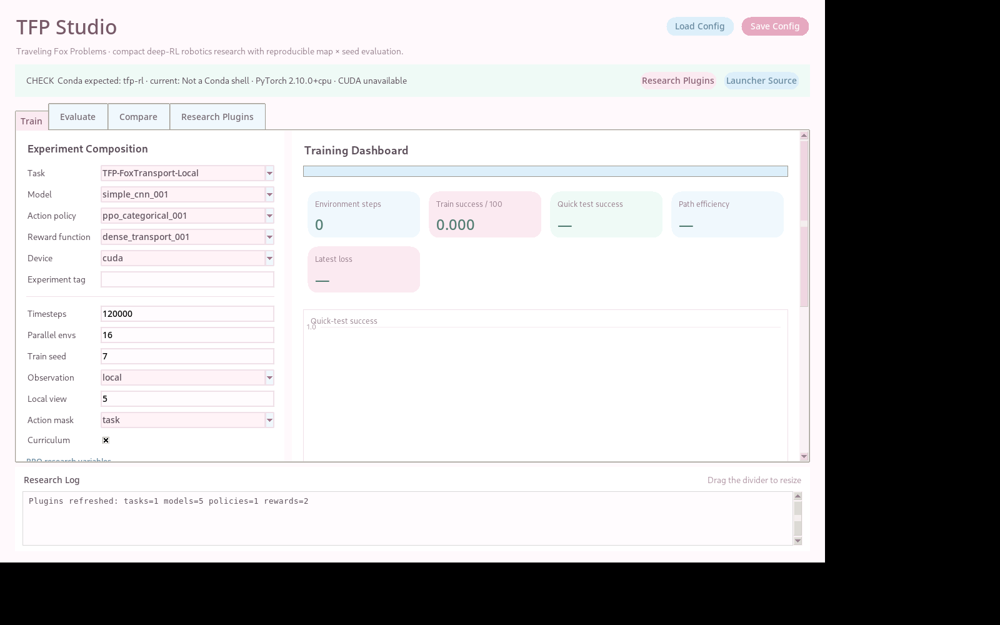
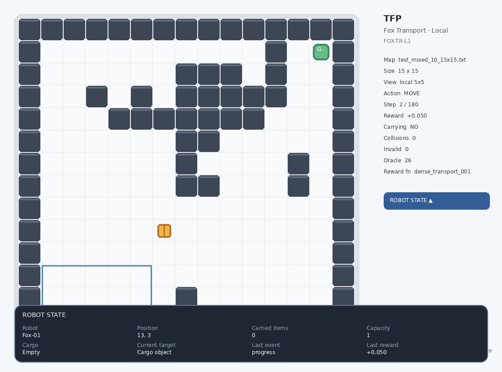

# TFP — Traveling Fox Problems

**A compact PyTorch research framework for Deep Reinforcement Learning, local robotic decision-making, and reproducible behavior analysis.**

TFP is designed for researchers who want a faster experimental loop than a full physics simulator while retaining meaningful robotics structure: partial observation, object interaction, navigation, topology variation, train/test separation, deterministic evaluation seeds, behavior diagnostics, and model deployment cost. The first benchmark, **Fox Transport · Local**, asks a small robot to find a cargo object, pick it up, and deliver it to a destination under a fixed 5×5 local observation.



## Research focus

TFP keeps the environment small enough for rapid iteration but exposes common RL research variables as independent plugins:

- **Models** — feed-forward CNNs, model-owned memory, inference controllers, or custom architectures.
- **Policies** — PPO is included; additional policy plugins can be added without rewriting tasks.
- **Rewards** — dense and sparse transport rewards are provided as replaceable modules.
- **Tasks** — named tasks own their maps, observation rules, and evaluation seeds.
- **Evaluation** — fixed map × seed testing reports success, steps, return, path efficiency, behavior cycles, state revisits, model size, and inference latency.

The framework is intended for fast hypothesis testing before moving promising ideas to MuJoCo, Isaac Lab, Gazebo, or real hardware.

## Fox Transport · Local

**Task ID:** `TFP-FoxTransport-Local`  
**Short code:** `FOX-TR-L1`

A fox robot receives a compact `10×5×5` local tensor and must complete **search → pickup → transport → delivery**. One object can be carried at a time. Maps contain walls, shelves, partitions, corridors, rooms, and mixed layouts designed to create local visual ambiguity without requiring a large simulator.



| Benchmark component | Setting |
|---|---:|
| Training maps | 54 |
| Unseen test maps | 18 |
| Map sizes | 10×10, 15×15, 20×20 |
| Topology families | aisle, partition, blocks, mixed, rooms, zigzag |
| Default evaluation seeds | 10 |
| Fixed evaluation episodes | **180** |
| Local observation | `10×5×5` |

Every unseen map is evaluated with the same deterministic seed set. This prevents one favorable random episode from dominating a model comparison and makes topology- and scale-level analysis straightforward.

## Quick start

### Windows

```bat
setup_conda_env.bat
select_tfp_env.bat
launch_tfp.bat
```

`select_tfp_env.bat` stores the selected Conda environment in `config/conda_env.txt`; the launcher therefore uses the requested environment instead of whichever Python happens to be on `PATH`. In Studio, select **CUDA** to require a CUDA-capable PyTorch runtime. If CUDA is unavailable, TFP reports the mismatch instead of silently changing devices.

### Linux

```bash
bash launch_tfp.sh
```

The Studio provides four main research views:

- **Train** — compose Task × Model × Policy × Reward experiments and configure PPO.
- **Evaluate** — run data-only, live-display, or live-display + MP4 evaluation.
- **Compare** — compare saved runs in one sortable table.
- **Research Plugins** — inspect and extend models, policies, rewards, and tasks.

Training saves the **best validation checkpoint** as `<model>.pt` and the final optimization state as `<model>.last.pt`. Best-model selection uses a deterministic validation subset built from training layouts; the unseen test suite is not used for checkpoint selection.

## Extending TFP

A researcher can add a model by placing a file such as:

```text
tfp/models/my_model.py
```

and implementing `MODEL_SPEC` plus `create_model(observation_shape, action_count)`. Stateless models need only `forward`. Models with internal behavior memory can optionally implement model-owned hooks such as action-memory context, while inference-only controllers can rewrite greedy deployment actions without modifying PPO sampling. The environment observation shape remains unchanged.

The same plugin pattern is used for:

```text
tfp/models/
tfp/policies/
tfp/rewards/
tfp/tasks/
```

See [`docs/MODEL_PLUGIN_GUIDE.md`](docs/MODEL_PLUGIN_GUIDE.md) and [`docs/EXPERIMENT_CHECKLIST.md`](docs/EXPERIMENT_CHECKLIST.md).

## Built-in model research

### 1. `simple_cnn_001` — visual RL baseline

`simple_cnn_001` establishes the minimum learned baseline for Fox Transport. It uses three small convolutional layers followed by a 128-dimensional shared feature layer and separate policy and value heads. The model receives only the current local observation; it has no recurrent state, action history, map memory, or hand-designed escape rule. This intentionally exposes the behavior of a reactive visual PPO policy under partial observation. The model is small enough to train quickly and makes failures easy to interpret: when two local observations look similar, the greedy policy may repeatedly select the same high-logit action or oscillate between inverse actions. Its role is therefore not to maximize benchmark performance, but to provide a controlled reference for asking whether additional behavior memory or inference-time search priors solve identifiable robotic failure modes. The same trained weights are reused by the Tabu-based variants so controller effects can be measured without retraining the underlying CNN.

### 2. `simple_cnn_tabu_002` — short action-cycle suppression

`simple_cnn_tabu_002` keeps the trainable neural network identical to the baseline and applies Tabu logic only during greedy evaluation or deployment. PPO training is untouched. The controller remembers a short sequence of executed actions and detects periodic motifs such as `LEFT→RIGHT→LEFT→RIGHT`, repeated single actions, short three-action cycles, and interaction loops such as `PICKUP→DROP→PICKUP→DROP`. When the next neural action would continue the detected motif, the controller selects the highest-scoring legal alternative from the original CNN logits. This design tests a narrow hypothesis: some deployment failures are not failures of object recognition or value learning, but persistent local action selection loops. Because the controller does not read the hidden map, oracle path, or privileged position, it remains compatible with the partially observed task. Its limitation is equally important: once the robot makes one escape action, the original short-cycle memory may decay quickly enough for the policy to re-enter the same local trap from a neighboring state.

### 3. `action_memory_cnn_003` — learnable action-history memory

`action_memory_cnn_003` tests whether a neural policy can learn useful short-term behavior context without storing previous images or using an LSTM. The visual encoder remains the same compact CNN, while the model internally records the last eight executed action IDs. Those actions are mapped through a learnable embedding, processed by a small temporal convolution, pooled into a behavior feature, and injected into the visual representation through a residual adapter. The environment still supplies exactly one `10×5×5` observation, so no task or observation code changes are required. During PPO collection, TFP stores the precise action-history context used at decision time; shuffled minibatch optimization therefore reconstructs the correct policy input instead of accidentally treating minibatch order as temporal order. This model explores a lightweight alternative to recurrent networks: memory represents **what the robot has recently done**, not a sequence of raw frames. It improves behavioral context with a modest parameter increase, although learned memory alone does not explicitly forbid revisiting a known local failure basin.

### 4. `simple_cnn_tabux_004` — local-basin TabuX controller

`simple_cnn_tabux_004` extends the inference-only Tabu idea from action motifs to short-term **local-basin memory**. The neural weights remain identical to `simple_cnn_001`; only the deployment decision layer changes. TabuX integrates executed movement actions into a relative behavior coordinate and tracks recently revisited states and transitions. When repeated movement reveals a small two-, three-, or four-state basin, the controller assigns temporary tabu tenure to transitions that keep the robot inside the basin. Crucially, the tenure survives the first escape move. If the CNN immediately proposes an action that would return to the recently escaped region, TabuX can reject that action and choose the next legal neural alternative. An aspiration/relaxation rule prevents the controller from deadlocking the robot when every available action is temporarily tabu. TabuX uses no hidden map or oracle route; its memory is derived only from executed behavior. The model therefore isolates whether a lightweight search-inspired deployment prior can compensate for reactive-policy aliasing without changing RL training.

### 5. `action_memory_tabux_cnn_005` — learned behavior memory + TabuX

`action_memory_tabux_cnn_005` combines the two strongest behavior hypotheses in the project. During PPO training, it is exactly the learnable Action-Memory CNN: recent actions are embedded, temporally encoded, and fused into the CNN feature. During greedy deployment, an independent TabuX controller is added after the neural decision. The learned branch can adapt policy logits using recent behavior context, while TabuX provides an explicit short-term rule against returning to a recently identified local trap. These mechanisms operate at different levels and are intentionally kept separate: action memory is differentiable and learned from reward, whereas TabuX is non-differentiable, inference-only, and search-inspired. This model asks whether learned history and explicit anti-trap memory are complementary or redundant. Importantly, the combination is not assumed to be better. A learned policy may already alter its preferred escape direction, and a strong external controller can occasionally constrain that preference. The architecture is therefore useful as an ablation target for studying interactions between learned behavior representations and deployment-time decision priors.

## Initial controlled study

The packaged reference study uses the same **18 unseen maps × 10 deterministic seeds = 180 episodes**. `simple_cnn_001` and `action_memory_cnn_003` were trained for 32,768 PPO steps with training seed 7. The Tabu and TabuX variants reuse their corresponding trained neural weights and differ only in inference-time control where stated.

| Method | Params | Success | Mean steps | Cycle events | State revisit | CPU inference* |
|---|---:|---:|---:|---:|---:|---:|
| Simple CNN 001 | 121.8k | 0.378 | 125.3 | 107.6 | 0.571 | 0.277 ms |
| Simple CNN + Tabu 002 | 121.8k | 0.556 | 102.0 | 16.2 | 0.472 | 0.328 ms |
| Action-Memory CNN 003 | 132.4k | 0.578 | 93.3 | 73.9 | 0.396 | 0.731 ms |
| Simple CNN + TabuX 004 | 121.8k | **0.878** | 58.1 | 7.1 | 0.200 | 0.458 ms |
| Action-Memory + TabuX 005 | 132.4k | 0.861 | **57.2** | **6.7** | **0.190** | 0.905 ms |

\* Inference latency is hardware- and runtime-specific and should only be compared on the same machine.

### First experimental finding

The first controlled study suggests that a major failure mode in this compact partially observed transport task is not simply insufficient visual capacity; it is **persistent local decision recurrence**. The reactive CNN succeeds in only 37.8% of the 180 unseen evaluation episodes and exhibits an average of 107.6 detected periodic cycle events with a 0.571 state-revisit rate. Adding the original inference-only Tabu filter to the same neural weights raises success to 55.6% and sharply reduces periodic action cycles, showing that a meaningful portion of the baseline error can be corrected without changing PPO training. The learnable Action-Memory CNN reaches 57.8% success and lowers state revisits further, supporting the hypothesis that recent executed actions contain useful context when local visual observations are ambiguous.

The stronger result comes from TabuX. By retaining short-term memory of recently repeated local states and transitions after the first escape action, the same baseline CNN reaches 87.8% success. This indicates that breaking an `A↔B` oscillation is not sufficient: the robot must also avoid immediately re-entering the small behavior basin that generated the oscillation. Action-Memory + TabuX reaches 86.1%, with the lowest mean steps and state-revisit rate, but does not exceed the simpler CNN + TabuX in success. That non-additive result is informative. Learned action history and explicit search-inspired constraints appear to solve overlapping parts of the decision problem, and a stronger external controller may occasionally override a useful learned preference.

These results are an **initial exploratory study, not a statistical conclusion**: the trainable models use one training seed and the reported latency comes from one runtime. The next formal experiment should repeat training across multiple independent seeds and ablate Tabu tenure, basin size, action-history length, reward design, and topology family. Raw CSV/JSON results are provided in `reference_results/initial_study/` for reproducibility.

## Evaluation and reproducibility

Each evaluation stores both aggregate and per-episode data, including:

- success and pickup rate;
- episode steps, return, and oracle-relative path efficiency;
- collisions and invalid actions;
- periodic behavior-cycle events and interaction cycles;
- state-revisit rate;
- model parameter count and inference latency;
- task, model, policy, reward, seed, checkpoint, Python, PyTorch, CUDA, and device metadata.

Use the same fixed map × seed suite for method comparisons and repeat trainable methods with multiple independent training seeds before making statistical claims.

## Repository structure

```text
Traveling-Fox-Problems/
├─ README.md
├─ LICENSE
├─ CITATION.cff
├─ environment.yml
├─ requirements.txt
├─ tfp_studio.py
├─ launch_tfp.bat / launch_tfp.sh
├─ config/
├─ checkpoints/                 # packaged reference weights + local best/last outputs
├─ docs/
├─ experiments/
├─ reference_results/
│  └─ initial_study/
├─ results/
├─ tests/
├─ tools/
└─ tfp/
   ├─ envs/
   ├─ evaluation/
   ├─ models/
   ├─ policies/
   ├─ rewards/
   ├─ tasks/
   ├─ training/
   └─ visualization/
```

## Scope

TFP is a compact research environment, not a physics-accurate substitute for a full robotics simulator. It is intended to make small embodied-RL hypotheses inexpensive to test, inspect, and reproduce, then provide a clean path for transferring promising ideas to richer simulation or hardware.

## License

MIT. See [`LICENSE`](LICENSE).
