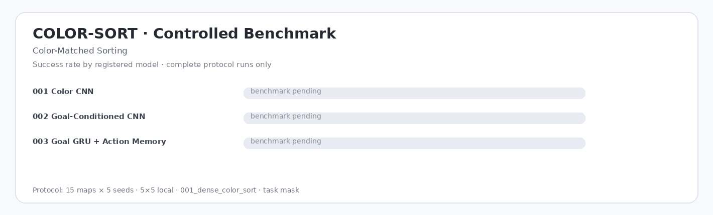

# COLOR-SORT — Color-Matched Sorting

| Model | Params | Runs | N | Success ↑ | Completion ↑ | Pickup ↑ | Steps ↓ | Return ↑ | Path Eff. ↑ | Collision ↓ | Invalid ↓ | Cycles ↓ | Interact cycles ↓ | Revisit ↓ | Infer ms ↓ |
|---|---:|---:|---:|---:|---:|---:|---:|---:|---:|---:|---:|---:|---:|---:|---:|
| `001_color_cnn` | 125.3k | — | — | — | — | — | — | — | — | — | — | — | — | — | — |
| `002_goal_conditioned_cnn` | 233.8k | — | — | — | — | — | — | — | — | — | — | — | — | — | — |
| `003_goal_gru_action_memory` | 144.9k | — | — | — | — | — | — | — | — | — | — | — | — | — | — |

*Evaluation: 15 test maps × 5 seeds = 75 episodes/run · `local` 5×5 · `001_dense_color_sort` · `task` mask · `001_ppo_categorical`. `—` = pending.*

