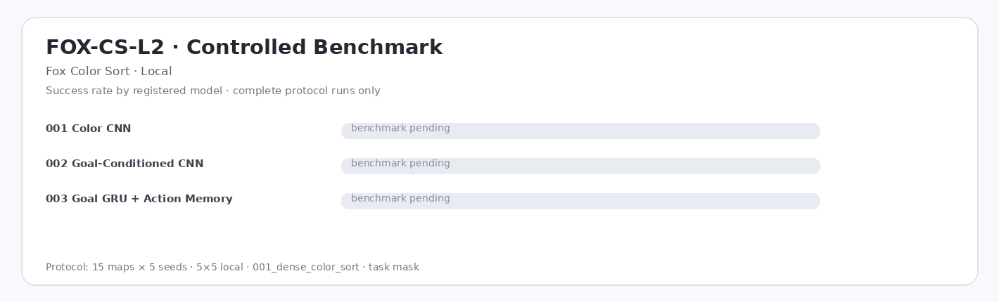

# FOX-CS-L2 — Fox Color Sort · Local

Controlled cross-model benchmark generated from complete evaluation records.

| Model | Params | Runs | N | Success ↑ | Completion ↑ | Pickup ↑ | Steps ↓ | Return ↑ | Path Eff. ↑ | Collision ↓ | Invalid ↓ | Cycles ↓ | Interact cycles ↓ | Revisit ↓ | Infer ms ↓ |
|---|---:|---:|---:|---:|---:|---:|---:|---:|---:|---:|---:|---:|---:|---:|---:|
| `001_color_cnn` | 125.3k | — | — | — | — | — | — | — | — | — | — | — | — | — | — |
| `002_goal_conditioned_cnn` | 233.8k | — | — | — | — | — | — | — | — | — | — | — | — | — | — |
| `003_goal_gru_action_memory` | 144.9k | — | — | — | — | — | — | — | — | — | — | — | — | — | — |

*Controlled protocol: 15 test maps × 5 seeds = 75 episodes/run, `local` 5×5, `001_dense_color_sort`, `task` mask, `001_ppo_categorical`. Only complete protocol-matched runs enter this table; repeated runs are averaged. `—` means no qualifying benchmark yet.*

Ad-hoc, smoke, and ablation evaluations remain visible in **TFP Studio → Compare** but do not alter this table.
