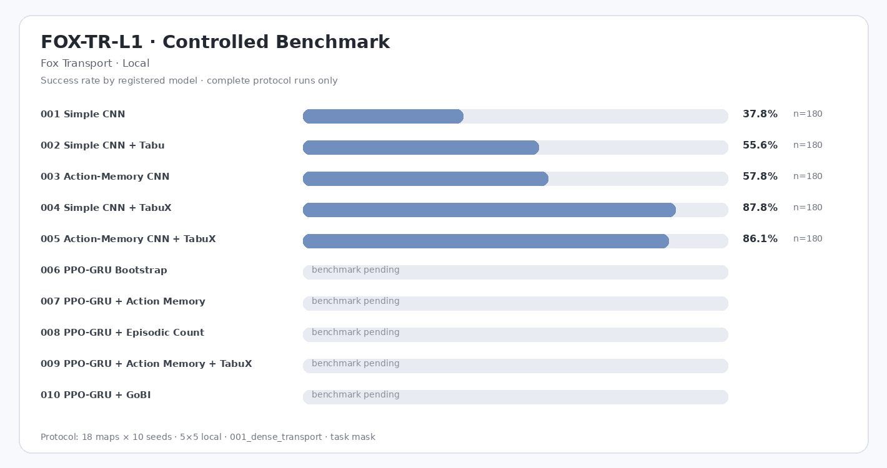

# FOX-TR-L1 — Fox Transport · Local

Controlled cross-model benchmark generated from complete evaluation records.

| Model | Params | Runs | N | Success ↑ | Completion ↑ | Pickup ↑ | Steps ↓ | Return ↑ | Path Eff. ↑ | Collision ↓ | Invalid ↓ | Cycles ↓ | Interact cycles ↓ | Revisit ↓ | Infer ms ↓ |
|---|---:|---:|---:|---:|---:|---:|---:|---:|---:|---:|---:|---:|---:|---:|---:|
| `001_simple_cnn` | 121.8k | 1 | 180 | 37.8% | 37.8% | 73.9% | 125.3 | 5.42 | 0.996 | 0.00 | 0.00 | 107.61 | 0.00 | 57.1% | 0.277 |
| `002_simple_cnn_tabu` | 121.8k | 1 | 180 | 55.6% | 55.6% | 73.9% | 102.0 | 6.74 | 0.835 | 0.00 | 0.00 | 16.19 | 0.00 | 47.2% | 0.328 |
| `003_action_memory_cnn` | 132.4k | 1 | 180 | 57.8% | 57.8% | 75.6% | 93.3 | 6.94 | 0.988 | 0.00 | 0.00 | 73.88 | 0.00 | 39.6% | 0.731 |
| `004_simple_cnn_tabux` | 121.8k | 1 | 180 | 87.8% | 87.8% | 93.3% | 58.1 | 9.66 | 0.828 | 0.00 | 0.00 | 7.09 | 0.00 | 20.0% | 0.458 |
| `005_action_memory_tabux_cnn` | 132.4k | 1 | 180 | 86.1% | 86.1% | 91.7% | 57.2 | 9.49 | 0.881 | 0.00 | 0.00 | 6.67 | 0.00 | 19.0% | 0.905 |
| `006_ppo_gru_bootstrap` | 167.4k | — | — | — | — | — | — | — | — | — | — | — | — | — | — |
| `007_ppo_gru_action_memory` | 141.5k | — | — | — | — | — | — | — | — | — | — | — | — | — | — |
| `008_ppo_gru_episodic_count` | 133.3k | — | — | — | — | — | — | — | — | — | — | — | — | — | — |
| `009_ppo_gru_action_memory_tabux` | 141.5k | — | — | — | — | — | — | — | — | — | — | — | — | — | — |
| `010_ppo_gru_gobi` | 133.3k | — | — | — | — | — | — | — | — | — | — | — | — | — | — |

*Controlled protocol: 18 test maps × 10 seeds = 180 episodes/run, `local` 5×5, `001_dense_transport`, `task` mask, `001_ppo_categorical`. Only complete protocol-matched runs enter this table; repeated runs are averaged. `—` means no qualifying benchmark yet.*

Ad-hoc, smoke, and ablation evaluations remain visible in **TFP Studio → Compare** but do not alter this table.
