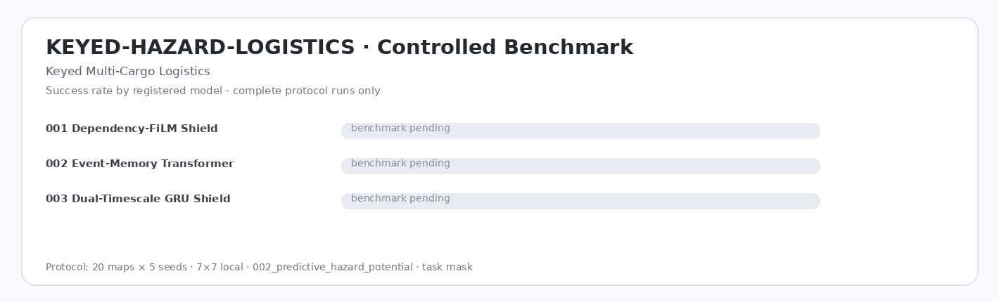

# KEYED-HAZARD-LOGISTICS — Keyed Multi-Cargo Logistics

| Model | Params | Runs | N | Success ↑ | Completion ↑ | Pickup ↑ | Steps ↓ | Return ↑ | Path Eff. ↑ | Collision ↓ | Invalid ↓ | Cycles ↓ | Interact cycles ↓ | Revisit ↓ | Infer ms ↓ |
|---|---:|---:|---:|---:|---:|---:|---:|---:|---:|---:|---:|---:|---:|---:|---:|
| `001_dependency_film_shield` | 808.5k | — | — | — | — | — | — | — | — | — | — | — | — | — | — |
| `002_event_memory_transformer` | 929.8k | — | — | — | — | — | — | — | — | — | — | — | — | — | — |
| `003_dual_timescale_gru_shield` | 992.0k | — | — | — | — | — | — | — | — | — | — | — | — | — | — |

*Evaluation: 20 test maps × 5 seeds = 100 episodes/run · `local` 7×7 · `002_predictive_hazard_potential` · `task` mask · `001_ppo_categorical`. `—` = pending.*

