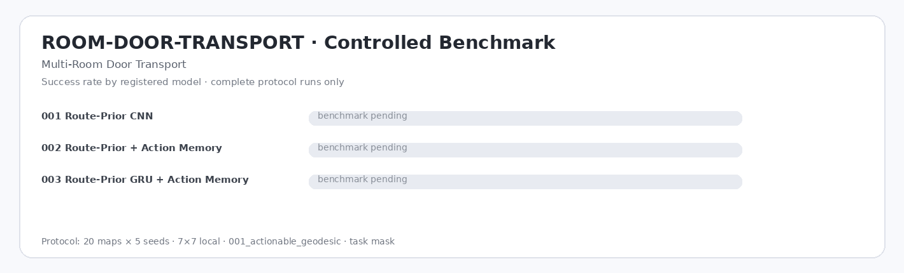

# ROOM-DOOR-TRANSPORT — Multi-Room Door Transport

| Model | Params | Runs | N | Success ↑ | Completion ↑ | Pickup ↑ | Steps ↓ | Return ↑ | Path Eff. ↑ | Collision ↓ | Invalid ↓ | Cycles ↓ | Interact cycles ↓ | Revisit ↓ | Infer ms ↓ |
|---|---:|---:|---:|---:|---:|---:|---:|---:|---:|---:|---:|---:|---:|---:|---:|
| `001_route_prior_cnn` | 393.2k | — | — | — | — | — | — | — | — | — | — | — | — | — | — |
| `002_route_prior_action_memory` | 422.3k | — | — | — | — | — | — | — | — | — | — | — | — | — | — |
| `003_route_prior_gru_memory` | 520.8k | — | — | — | — | — | — | — | — | — | — | — | — | — | — |

*Evaluation: 20 test maps × 5 seeds = 100 episodes/run · `local` 7×7 · `001_actionable_geodesic` · `task` mask · `001_ppo_categorical`. `—` = pending.*

